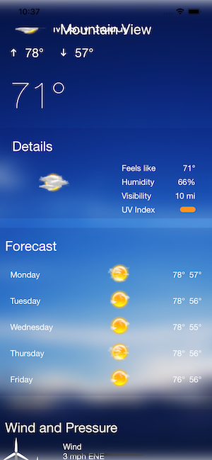
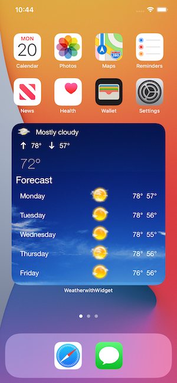
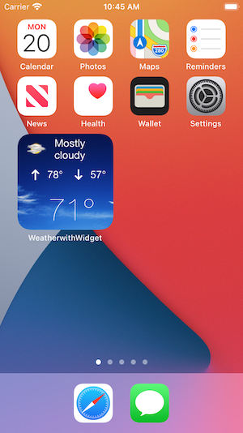

# Weather with Widgets

WeatherWithWidgets is an iOS 14 weather app written with SwiftUI. It uses the AccuWeather API (free limited use keys) and has a UI similar to the Yahoo! weather app. It also has a large and small widget. These can be run / tested in Xcode separately from the app. I haven't installed iOS 14 on my iPhone yet, so it has only been tested on simulators. They work fine standalone, and launch the app when pressed.

<

## License

WeatherWithWidgets is licensed under the Unlicense. See the LICENSE file for more information, but basically this is sample code and you can do whatever you want with it.
